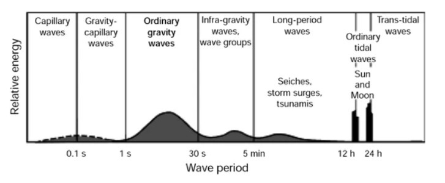

# ocean-das-training
DAS (Distributed Acoustic Sensing) analysis for the SUBMERSE Oceanographic Applications training session. Featuring GeoLab fibre data from Madeira Island, Portugal.

Fiber optics for Oceanographic Applications Image

**Presenters**: Aggeliki Barberopoulou, Thania Papapostolou (Hellenic Center for Marine Research)
**Code Developer**

## 📌 Objectives

* Read one DAS file
* Visualise data in time and frequency domains
* Present some examples of processing data for analysis

In this notebook we will take a look at a basic methodology one can follow to read Image and visualise DAS files.

For our demonstration we are using a 1 hour DAS file constructed from data recorded by the GeoLab fibre, installed on the southern coast of Madeira Island, Portugal.  

The data file has been processed as follows:

* concatenated from 10 second DAS data (500Hz sampling rate) into 1 hour files,
* filtered with a 4th order butterworth filter (cutoff frequency = 45Hz),
* downsampled to 50Hz
* Number of channels have also been reduced to about 1/10th (1137)

The above processing has been semi automated and this is a sample of the work performed   on records to identify "critical" energy  
## 🛠️ Technical Credits
**Lead Developer:** Ippolyte (HCMR)
*Processing scripts and visualization architecture developed by **Ippolyte**.*

## 🛠️ Software Note: 
Processing workflow developed by Ippolyte, including specific functions adapted from the **ROSES (Remote Online Sessions for Emerging Seismologists)** (Eileen Martin) for handling GeoLab .hdf5 data.

## 🙏 Acknowledgments:
GeoLab is an initiative aimed at the research community with the participation of Fundação para a Ciência e Tec30 nologia (FCT), Fundação para a Computação Científica Nacional (FCCN), Agência Regional para o Desenvolvimento (Credits: Loureiro et al. 2026)

> **Figure 1:** [Figure 3.1] from Folley, M. (2017). *The Wave Energy Resource*. In: Pecher, A., Kofoed, J. (eds) Handbook of Ocean Wave Energy. Ocean Engineering & Oceanography, vol 7. Springer, Cham. [https://doi.org/10.1007/978-3-319-39889-1_3](https://doi.org/10.1007/978-3-319-39889-1_3)
